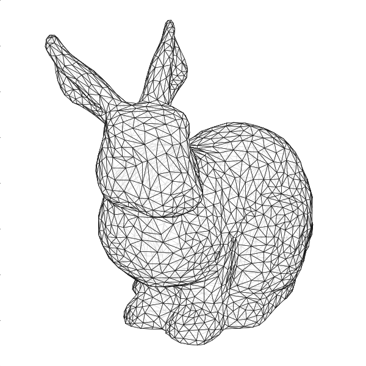

# GL Mathematics with Numpy

GLM offers a set of objects and functions to ease the design of 3D applications while taking advantage of the numpy library. The main objects are vectors (`vec2`, `vec3`, `vec4`), matrices (`mat2`, `mat3`, `mat4`) and vectorized lists (`vlist`).  Vectors and matrices possess several variants depending on the base type (see below) and are memory tracked. This means it is possible to know anytime the smallest contiguous block of memory that has changed. This can be used to maintain a GPU copy up-to-date.

#### Example usage

This is the code to get the 3D bunny display on the top-right corner. You'll need  [meshio](https://github.com/nschloe/meshio) to read the mesh file and [matplotlib](https://matplotlib.org/) to display it.

```python
import glm
import numpy as np

# Read mesh, get vertices (vec3) and face indices (int)
import meshio
mesh = meshio.read("bunny.obj")
vertices, indices = mesh.points, mesh.cells[0].data

# Transform: Model / View / Projection matrix (MVP)
MVP = glm.perspective(25, 1, 1, 100) @ glm.translate(0.1, -0.45, -2.5)
MVP = MVP @ glm.xrotate(20) @ glm.yrotate(45) @ glm.scale(5)

# Apply transform
vertices = glm.vec3(glm.vec4(vertices) @ MVP.T)

# Generate faces and sort them
faces = vertices[indices]
faces = faces[np.argsort(-faces[...,2].mean(axis=1))]

# Render faces using matplotlib
import matplotlib.pyplot as plt
from matplotlib.collections import PolyCollection
fig = plt.figure(figsize=(6,6))
ax = fig.add_axes([0,0,1,1], aspect=1, frameon=False, xlim=[-1,+1], ylim=[-1,+1])
ax.add_collection(PolyCollection(faces[...,:2], alpha=0.85, linewidth = 0.5,
                                 facecolor="white", edgecolor="black"))
plt.show()
```

## API

### Vectors & Matrices

The generic notation is:

* `TvecN` for vectors
* `TmatN` for matrices,

with T in [`b`, `i` , `u`, `h`, `d`, `f`, Ø] and N in [2,3,4].

| Symbol | Type             | Size    | Dtype         |
|--------|------------------|---------|---------------|
| `b`    | unsigned integer | 8 bits  | `np.uint8`    |
| `i`    | signed integer   | 32 bits | `np.int32`    |
| `u`    | unsigned integer | 32 bits | `np.uint32`   |
| `h`    | float            | 16 bits | `np.float16`  |
|  Ø     | float            | 32 bits | `np.float32`  |
| `h`    | float            | 64 bits | `np.float64`  |

**Example usage**

```python
import glm

# 10 x 3-components vectors of integers (32 bits)
V = glm.ivec3(10)
V.xyz = 1,2,3

# 10 x 3-components vectors of float (32 bits)
V = glm.vec3(10)

# Conversion from vec3 to vec4 (w set to 1)
V = glm.vec4(V)

# Conversion from vec4 to vec3 (xyz divided by w)
V = glm.vec3(V)

# A 4x4 matrix of floats (32 bits)
M = glm.mat4()
M.xyzw = 1,2,3,1

```

### Vectorized lists 

Vectorized lists (`vlist`) correspond to ragged arrays where items have the same type but different lengths. There are three way to declare a vectorized list.

**Example usage**

```python
import glm

# A list of 3 groups of vectors with size 3,3,4
V = glm.vlist([glm.vec4(3), glm.vec4(3), glm.vec4(3)])

# A list of 3 groups of vectors with size 3,3,4
V = glm.vlist(glm.vec4(10), [3,3,4])

# A list of 5 groups of vectors with size 2
V = glm.vlist(glm.vec4(10), 2)

# Display each item
for v in V: print(v)
```

The underlying structure is a regular numpy array (`vlist.data`).


### GL and GLU

* glm.**[viewport](https://registry.khronos.org/OpenGL-Refpages/gl4/html/glViewport.xhtml)**(x, y, width, height, *dtype=np.float32, transpose=False*)
  
  > Return a 4x4 matrix that transforms normalized device coordinates
  > to window coordinates.
  >
  > | Parameters  | Type    | Description                    |
  > |:------------|:--------|:-------------------------------|
  > | `x`         | float   | Viewport x origin (lower left) |
  > | `y`         | float   | Viewport x origin (lower left) |
  > | `width`     | float   | Viewport width                 |
  > | `height`    | float   | Viewport height                |
  > | `dtype`     | dtype   | Dtype of the resulting matrix  |
  > | `transpose` | boolean | Whether to transpose result    |

* glm.**[ortho](https://registry.khronos.org/OpenGL-Refpages/gl2.1/xhtml/glOrtho.xml)**(left, right, bottom, top, znear, zfar, *dtype=np.float32, transpose=False*)

  > Return a 4x4 matrix that produces a parallel projection. 
  >
  > | Parameters  | Type    | Description                    |
  > |:------------|:--------|:-------------------------------|
  > | `left`      | float   | Left clipping plane            |
  > | `right`     | float   | Right clipping plane           |
  > | `bottom`    | float   | Bottom clipping plane          |
  > | `top`       | float   | Top clipping plane             |
  > | `znear`     | float   | Near clipping plane            |
  > | `zfar`      | float   | Far clipping plane             |
  > | `dtype`     | dtype   | Dtype of the resulting matrix  |
  > | `transpose` | boolean | Whether to transpose result    |

* glm.**[frustum](https://registry.khronos.org/OpenGL-Refpages/gl2.1/xhtml/glFrustum.xml)**(left, right, bottom, top, znear, zfar, *dtype=np.float32, transpose=False*)

  > Return a 4x4 matrix that produces a perspective projection. 
  >
  > | Parameters  | Type    | Description                    |
  > |:------------|:--------|:-------------------------------|
  > | `left`      | float   | Left clipping plane            |
  > | `right`     | float   | Right clipping plane           |
  > | `bottom`    | float   | Bottom clipping plane          |
  > | `top`       | float   | Top clipping plane             |
  > | `znear`     | float   | Near clipping plane            |
  > | `zfar`      | float   | Far clipping plane             |
  > | `dtype`     | dtype   | Dtype of the resulting matrix  |
  > | `transpose` | boolean | Whether to transpose result    |

* glm.**[perpective](https://registry.khronos.org/OpenGL-Refpages/gl2.1/xhtml/gluPerspective.xml)**(fovy, aspect, znear, zfar, *dtype=np.float32, transpose=False*)

  > Return a 4x4 matrix corresponding to a viewing frustum into the
  > world coordinate system. In general, the aspect ratio in
  > perspective should match the aspect ratio of the associated
  > viewport. For example, aspect = 2.0 means the viewer's angle of
  > view is twice as wide in x as it is in y. If the viewport is twice
  > as wide as it is tall, it displays the image without distortion.
  >  
  > | Parameters  | Type    | Description                    |
  > |:------------|:--------|:-------------------------------|
  > | `fovy`      | float   | Field of view angle (degrees in the y direction |
  > | `aspect`    | float   | Aspect ratio that determines the field of view in the x direction |
  > | `znear`     | float   | Near clipping plane            |
  > | `zfar`      | float   | Far clipping plane             |
  > | `dtype`     | dtype   | Dtype of the resulting matrix  |
  > | `transpose` | boolean | Whether to transpose result    |

* glm.**[scale](https://registry.khronos.org/OpenGL-Refpages/gl2.1/xhtml/glScale.xml)**(x, y, z, *dtype=np.float32, transpose=False*)
  
  > Return a 4x4 matrix for nonuniform scaling along the x, y, and z
  > axes. The three parameters indicate the desired scale factor along
  > each of the three axes.
  >
  > | Parameters  | Type    | Description                    |
  > |:------------|:--------|:-------------------------------|
  > | `x`         | float   | x scale factor                 |
  > | `y`         | float   | y scale factor                 |
  > | `z`         | float   | z scale factor                 |
  > | `dtype`     | dtype   | Dtype of the resulting matrix  |
  > | `transpose` | boolean | Whether to transpose result    |

* glm.**fit**(V)

  > Return vertices fitted to the normalized cube.
  >
  > | Parameters  | Type    | Description                    |
  > |:------------|:--------|:-------------------------------|
  > | `V`         | vecN    | Vertices to fit                |

* glm.**[rotate](https://registry.khronos.org/OpenGL-Refpages/gl2.1/xhtml/glRotate.xml)**(angle, x, y, z, *dtype=np.float32, transpose=False*)
  
  > Return a 4x4 matrix for a rotation of angle degrees around the
  > vector (x,y,z).
  >
  > | Parameters  | Type    | Description                    |
  > |:------------|:--------|:-------------------------------|
  > | `angle`     | float   | angle in degrees               |
  > | `x`         | float   | x scale factor                 |
  > | `y`         | float   | y scale factor                 |
  > | `z`         | float   | z scale factor                 |
  > | `dtype`     | dtype   | Dtype of the resulting matrix  |
  > | `transpose` | boolean | Whether to transpose result    |

* glm.**[xrotate]()**(angle, *dtype=np.float32, transpose=False*)
  
  > Return a 4x4 matrix for a rotation of angle degrees around the
  > x axis
  >
  > | Parameters  | Type    | Description                    |
  > |:------------|:--------|:-------------------------------|
  > | `angle`     | float   | angle in degrees               |
  > | `dtype`     | dtype   | Dtype of the resulting matrix  |
  > | `transpose` | boolean | Whether to transpose result    |

* glm.**[yrotate]()**(angle, *dtype=np.float32, transpose=False*)
  
  > Return a 4x4 matrix for a rotation of angle degrees around the
  > y axis
  >
  > | Parameters  | Type    | Description                    |
  > |:------------|:--------|:-------------------------------|
  > | `angle`     | float   | angle in degrees               |
  > | `dtype`     | dtype   | Dtype of the resulting matrix  |
  > | `transpose` | boolean | Whether to transpose result    |

* glm.**[zrotate]()**(angle, *dtype=np.float32, transpose=False*)
  
  > Return a 4x4 matrix for a rotation of angle degrees around the
  > z axis
  >
  > | Parameters  | Type    | Description                    |
  > |:------------|:--------|:-------------------------------|
  > | `angle`     | float   | angle in degrees               |
  > | `dtype`     | dtype   | Dtype of the resulting matrix  |
  > | `transpose` | boolean | Whether to transpose result    |

* glm.**align**(U, V, dtype=np.float32, transpose=False)

  > Return the rotation matrix M that aligns U to V such that V = U @
  > M.T
  >
  > | Parameters  | Type    | Description                    |
  > |:------------|:--------|:-------------------------------|
  > | `U`         | vecN    | First vector                   |
  > | `V`         | vecN    | Secnd vector                   |
  > | `dtype`     | dtype   | Dtype of the resulting matrix  |
  > | `transpose` | boolean | Whether to transpose result    |

* glm.**[translate](https://registry.khronos.org/OpenGL-Refpages/gl2.1/xhtml/glTranslate.xml)**(x, y, z, *dtype=np.float32, transpose=False*)
  
  > Return a 4x4 matrix for a translation by (x,y,z).
  >
  > | Parameters  | Type    | Description                    |
  > |:------------|:--------|:-------------------------------|
  > | `x`         | float   | x scale factor                 |
  > | `y`         | float   | y scale factor                 |
  > | `z`         | float   | z scale factor                 |
  > | `dtype`     | dtype   | Dtype of the resulting matrix  |
  > | `transpose` | boolean | Whether to transpose result    |

* glm.**center**(V)

  > Return vertices centered aroung the origin
  >
  > | Parameters  | Type    | Description                    |
  > |:------------|:--------|:-------------------------------|
  > | `V`         | vecN    | Vectices to center             |

* glm.**[lookat](https://registry.khronos.org/OpenGL-Refpages/gl2.1/xhtml/gluLookAt.xml)**(eye, center, up, *dtype=np.float32, transpose=False*)

  > Return a 4x4 a viewing matrix derived from an eye point, a
  > reference point indicating the center of the scene, and an UP
  > vector.
  >
  > The matrix maps the reference point to the negative z axis and the
  > eye point to the origin. When a typical projection matrix is used,
  > the center of the scene therefore maps to the center of the
  > viewport. Similarly, the direction described by the UP vector
  > projected onto the viewing plane is mapped to the positive y axis
  > so that it points upward in the viewport. The UP vector must not
  > be parallel to the line of sight from the eye point to the
  > reference point.
  >
  > | Parameters  | Type    | Description                    |
  > |:------------|:--------|:-------------------------------|
  > | `eye`       | vec3    | Eye position                   |
  > | `center`    | vec3    | Reference point                |
  > | `up`        | vec3    | Directino of the up vector     |
  > | `dtype`     | dtype   | Dtype of the resulting matrix  |
  > | `transpose` | boolean | Whether to transpose result    |

* glm.**[normalize](https://registry.khronos.org/OpenGL-Refpages/gl4/html/normalize.xhtml)**(V)

  > Return the unit vector in the same direction as the original vector
  >
  > | Parameters  | Type    | Description                    |
  > |:------------|:--------|:-------------------------------|
  > | `V`         | vecN    | Vector to normalize            |

* glm.**[clamp](https://registry.khronos.org/OpenGL-Refpages/gl4/html/clamp.xhtml)**(v)

  > Return value bound between vmin and vmax
  >
  > | Parameters  | Type             | Description                    |
  > |:------------|:-----------------|:-------------------------------|
  > | `value`     | float or vecN    | Value to normalize             |
  > | `vmin`      | float            | Minimum value                  |
  > | `vmax`      | float            | Maximum value                  |
